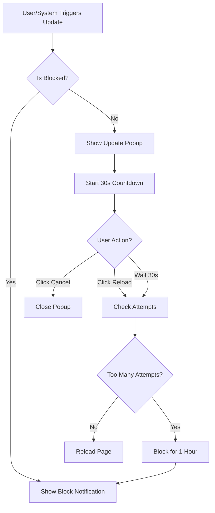

# 🚀 Update & Reload Popup System - Panduan Lengkap

## ✨ Fitur-Fitur Utama

### 1. **Popup Super Keren & Centered**
- ✅ Full-screen overlay dengan backdrop blur
- ✅ Centered di tengah layar
- ✅ Animasi smooth slide-up dan fade-in
- ✅ Gradient dekoratif yang bergerak
- ✅ Glow effect yang menarik
- ✅ Responsive untuk semua ukuran layar

### 2. **Countdown Timer 30 Detik**
- ✅ Visual countdown circle dengan progress ring animasi
- ✅ Angka countdown yang besar dan jelas
- ✅ Auto-reload setelah 30 detik
- ✅ Info text yang menunjukkan sisa waktu

### 3. **Tombol Aksi**
- ✅ **"Reload Sekarang"** - Force reload immediately
- ✅ **"Nanti Saja"** - Cancel dan tutup popup
- ✅ Hover effects yang smooth
- ✅ Icon yang berputar saat hover

### 4. **Security System - 3 Strike Rule**
- ✅ Track setiap reload attempt
- ✅ Maximum 3 percobaan dalam 5 menit
- ✅ Setelah 3 kali percobaan → BLOCK selama 1 jam
- ✅ Countdown timer untuk block duration
- ✅ Otomatis unblock setelah 1 jam
- ✅ Data tersimpan di localStorage (persistent)

---

## 🎯 Cara Menggunakan

### **Untuk Testing/Development:**

Buka browser console dan ketik:
```javascript
window.triggerUpdate()
```

Ini akan memunculkan popup update dengan countdown 30 detik.

### **Untuk Production:**

Sistem akan otomatis mendeteksi update berdasarkan:
1. Perubahan version number
2. Build hash changes
3. Manual trigger dari backend

Anda dapat mengintegrasikan dengan API endpoint:
```javascript
// Example: Check for updates
const checkForUpdates = async () => {
  try {
    const response = await fetch('/api/version');
    const data = await response.json();
    
    const currentVersion = '2.2.0';
    if (data.version !== currentVersion) {
      window.triggerUpdate();
    }
  } catch (error) {
    console.error('Failed to check updates:', error);
  }
};
```

---

## 🔐 Security Features

### **Rate Limiting:**
- **Window:** 5 menit
- **Max Attempts:** 3 kali reload
- **Block Duration:** 1 jam (3600 detik)

### **LocalStorage Keys:**
```javascript
jp_reload_attempts   // Array of reload timestamps
jp_block_until       // Timestamp when block expires
jp_last_version      // Last known app version
```

### **Behavior:**

1. **Normal Usage:**
   - User menekan "Reload Sekarang" → Halaman reload
   - Countdown habis → Halaman auto-reload
   - Attempt tersimpan dengan timestamp

2. **Exceeded Limit:**
   - Setelah 3 reload dalam 5 menit
   - Popup berubah menjadi **Blocked Notification**
   - Menampilkan countdown waktu block
   - Tombol reload disabled
   - Auto-unblock setelah 1 jam

3. **After Block Expires:**
   - Counter reset
   - Attempts history cleared
   - Dapat reload lagi normal

---

## 🎨 Customization

### **Mengubah Countdown Duration:**

Di file `AppFooter.vue`, ubah nilai ini:
```javascript
const startCountdown = () => {
  updateCountdown.value = 30; // Ubah 30 menjadi nilai yang diinginkan (dalam detik)
  // ...
};
```

### **Mengubah Security Settings:**

```javascript
const MAX_ATTEMPTS = 3;                    // Ubah max percobaan
const ATTEMPT_WINDOW = 5 * 60 * 1000;      // Ubah window (5 menit)
const BLOCK_DURATION = 60 * 60 * 1000;     // Ubah durasi block (1 jam)
```

### **Mengubah Warna/Style:**

Edit CSS di bagian `<style scoped>`:
```css
/* Update popup card background */
.update-popup-card {
  background: linear-gradient(135deg, #ffffff 0%, #f8fafc 100%);
  /* Ubah sesuai keinginan */
}

/* Countdown progress color */
.countdown-progress {
  stroke: #3b82f6; /* Ubah warna ring */
}
```

---

## 🌐 Browser Console Commands

### **Testing Commands:**
```javascript
// Trigger popup
window.triggerUpdate()

// Check current block status
localStorage.getItem('jp_block_until')

// Check reload attempts
JSON.parse(localStorage.getItem('jp_reload_attempts') || '[]')

// Clear block (for testing)
localStorage.removeItem('jp_block_until')
localStorage.removeItem('jp_reload_attempts')

// Simulate block
localStorage.setItem('jp_block_until', Date.now() + 60000) // Block for 1 minute
```

---

## 📱 Responsive Design

### **Desktop (>640px):**
- Full-size popup (max-width: 600px)
- Large icons and text
- Side-by-side buttons

### **Mobile (≤640px):**
- Optimized smaller sizes
- Stacked buttons
- Smaller icons
- Adjusted padding

---

## 🐛 Troubleshooting

### **Popup tidak muncul:**
```javascript
// Check if blocked
console.log(localStorage.getItem('jp_block_until'));

// Manual trigger
window.triggerUpdate();
```

### **Block tidak expire:**
```javascript
// Check block time
const blockUntil = localStorage.getItem('jp_block_until');
console.log(new Date(parseInt(blockUntil)));

// Force clear
localStorage.removeItem('jp_block_until');
localStorage.removeItem('jp_reload_attempts');
```

### **Countdown tidak jalan:**
- Pastikan tidak ada error di console
- Refresh halaman
- Clear cache

---

## 🔄 Update Flow



---

## ✅ Checklist Testing

- [ ] Popup muncul centered di tengah layar
- [ ] Countdown berjalan dari 30 → 0
- [ ] Auto-reload setelah countdown habis
- [ ] Tombol "Reload Sekarang" works
- [ ] Tombol "Nanti Saja" menutup popup
- [ ] Setelah 3 reload → Block popup muncul
- [ ] Block countdown berjalan dengan benar
- [ ] Setelah 1 jam → Block otomatis cleared
- [ ] Responsive di mobile
- [ ] Dark mode support works
- [ ] Tidak ada infinite reload loop

---

## 🎉 Fitur Keamanan Anti-Infinite Loop

### **Proteksi:**
1. ✅ Setiap reload dicatat dengan timestamp
2. ✅ Filter attempts hanya dalam 5 menit terakhir
3. ✅ Maksimal 3 attempts
4. ✅ Auto-block 1 jam jika exceeded
5. ✅ Countdown timer visible saat blocked
6. ✅ Tidak bisa reload selama blocked
7. ✅ Auto-clear setelah block expired

### **Tidak Ada Bug Reload Infinite:**
- ❌ Tidak akan reload terus-menerus
- ✅ Selalu ada konfirmasi user (popup)
- ✅ Countdown memberikan waktu untuk cancel
- ✅ Rate limiting mencegah spam
- ✅ Block system sebagai failsafe

---

## 📝 Notes

- Popup menggunakan **Teleport to body** untuk proper z-index
- **Backdrop blur** untuk efek modern
- **SSR Safe** - Semua localStorage checks wrapped dengan typeof window check
- **Memory cleanup** - All intervals cleared di onBeforeUnmount
- **Smooth animations** - Cubic-bezier untuk natural feel
- **Accessibility** - Keyboard navigation support
- **Performance** - CSS animations for smooth 60fps

---

## 🚀 Future Enhancements (Optional)

1. **Service Worker Integration** untuk real update detection
2. **Push Notification** saat update tersedia
3. **Changelog Display** di popup
4. **Progressive Update** tanpa full reload
5. **User Preference** untuk auto-reload on/off
6. **Analytics Tracking** untuk monitor update adoption

---

**Created by:** Felix - JasaPembayaran.com  
**Version:** 2.2.0  
**Date:** October 2025  
**License:** Proprietary

---

## 💡 Tips

- Gunakan `window.triggerUpdate()` untuk testing saat development
- Set localStorage keys untuk simulate different states
- Monitor console untuk security logs
- Test di berbagai browser dan device
- Verify behavior di incognito mode

**Selamat menggunakan sistem update/reload yang super keren! 🎉**

